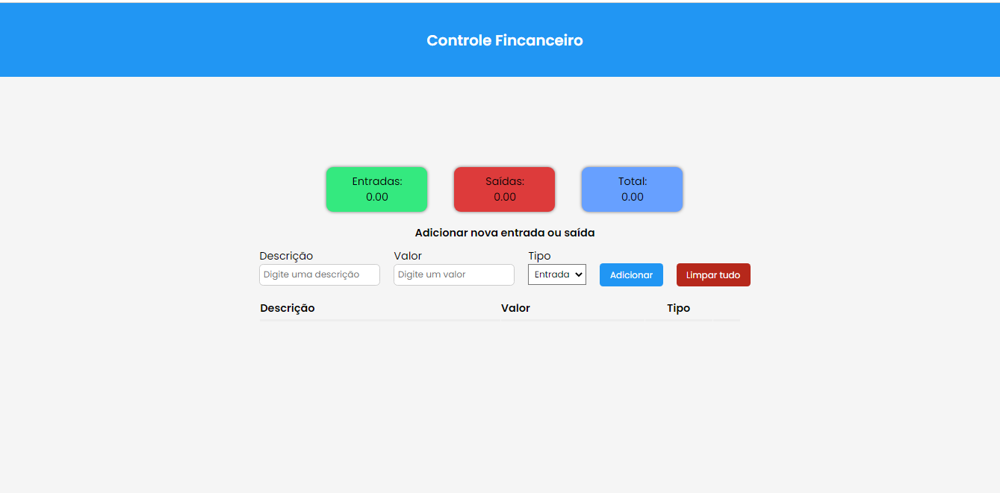
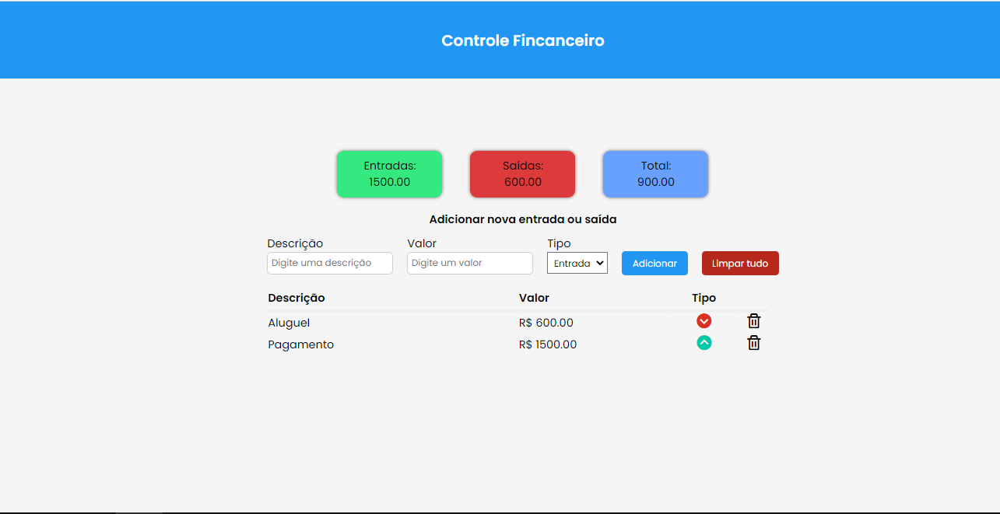
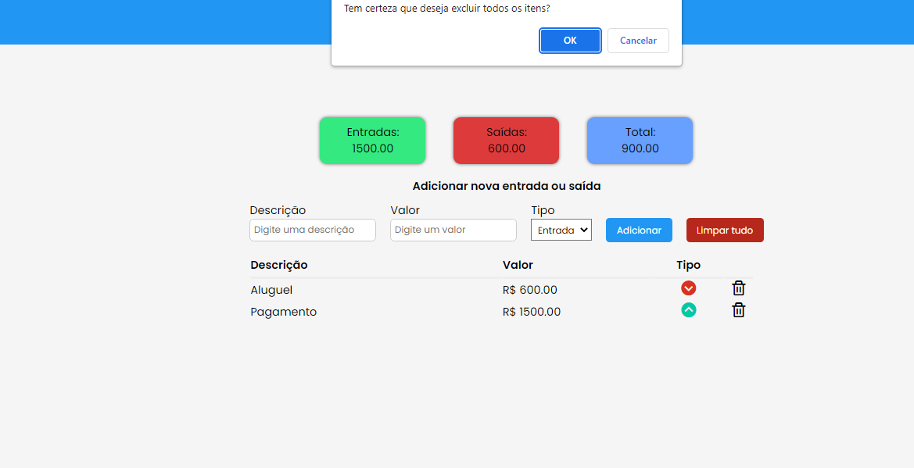

<h1> Controle Financeiro </h1>
Um site que te ajuda no controle da suas finanças 
<h2> Ainda está em desenvolvimento </h2> 
 

 
<h2> Imagem com os valores inseridos </h2>

 

<h2> Botão apagar tudo funcionando</h2>

## 🛠 Tecnologias Utilizadas

Esse projeto foi desenvolvido com as seguintes tecnologias:
- Javascript
- HTML e CSS
- Git e Github

**O que aprendi nesse desafio:**
- Variáveis no css 
- Criar funções no js

## 📞 Contato
beatriizangelis@gmail.com
